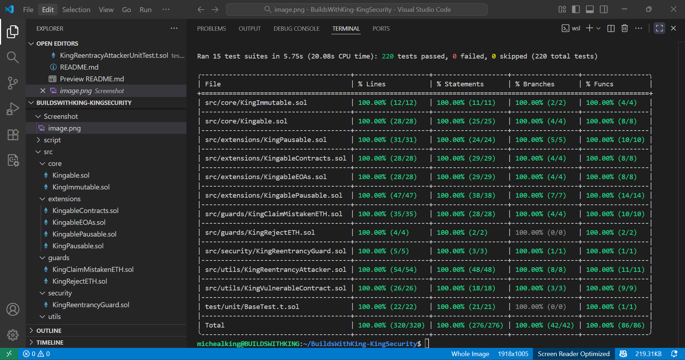

[](https://soliditylang.org/)
[](https://book.getfoundry.sh/)
[](https://book.getfoundry.sh/forge/writing-tests)
[](Screenshot/image.png)
[](https://github.com/BuildsWithKing/BuildsWithKing-KingSecurity)
[](LICENSE)
[](STATUS)


---


**A modular, audit-ready Solidity security suite — by @BuildsWithKing.**

---

# 🛡 BuildsWithKing-KingSecurity

A **security-focused Solidity suite** designed and implemented by **Michealking (@BuildsWithKing)**.  

This repository introduces modular smart contract security primitives such as **Kingable**, **KingPausable**, hybrid extensions, **KingClaimMistakenETH**, **KingReentrancyGuard** and **KingReentrancyAttacker**. Battle-tested with **unit tests**, **fuzz tests**, and **mock contracts** using Foundry.

> ⚠ Note: This repository serves as a testing and experimental workspace for the buildswithking-security library.
It is not versioned, and features here may change without notice.
For stable modules, use the main [BuildsWithKing-Security](https://github.com/BuildsWithKing/buildswithking-security) repo.

---

## 📑 Table of Contents
Audit-ready, modular Solidity security suite tested with Foundry.

- [🛡 BuildsWithKing-KingSecurity](#-buildswithking-kingsecurity)
  - [📑 Table of Contents](#-table-of-contents)
  - [🔒 Overview](#-overview)
  - [💡 Motivation](#-motivation)
  - [🏛 Core Contracts](#-core-contracts)
  - [🧩 Extensions](#-extensions)
  - [🛡 Guards](#-guards)
  - [🔐 Security](#-security)
  - [🧪 Utils](#-utils)
  - [🧪 Testing Strategy](#-testing-strategy)
    - [Unit Tests](#unit-tests)
    - [Fuzz Tests](#fuzz-tests)
    - [Mocks](#mocks)
  - [🔐 Coverage](#-coverage)
  - [🌳 File Structure](#-file-structure)
  - [🚀 Getting Started](#-getting-started)
    - [Prerequisites](#prerequisites)
    - [Clone \& Install](#clone--install)
    - [Build \& Test](#build--test)
    - [Check Coverage with:](#check-coverage-with)
    - [Gas snapshot](#gas-snapshot)
  - [⚡Installation:](#installation)
  - [🛠️ Usage](#️-usage)
  - [🛡 Security Considerations](#-security-considerations)
  - [✍ Author](#-author)
  - [📜 License](#-license)

---

## 🔒 Overview
This **KingSecurity suite** enforces **ownership, pausing, and authority mechanics** in a way that is:

- ✅ Transparent  
- ✅ Modular  
- ✅ Audit-friendly  

Each module is shipped with:
- **Custom errors** (gas-optimized revert reasons)  
- **Events** (state-change transparency)  
- **Modifiers & Guards** (king-only execution, contract/EOA filtering)  
- **Extensive test coverage** (unit + fuzzing)  

---

## 💡 Motivation
Smart contract exploits often arise from **improper access control, missing pause mechanisms, or weak invariants**.  
This project tackles those pain points by building **security extensions** that can be plugged into larger protocols.

> ⚡ This repository is not a step-by-step guide, but a reference testing suite for the main [BuildsWithKing-Security](https://github.com/BuildsWithKing/buildswithking-security) repository.

---

## 🏛 Core Contracts
1. **Kingable.sol**  
   - Introduces the **“King” role** (customizable ownership).  
   - Supports *transferring* and *renouncing* kingship.  

2. **KingImmutable.sol**  
   - Immutable king set at deployment.  
   - No transfer or renounce allowed (*one true king forever*).  

---

## 🧩 Extensions
1. **KingPausable.sol**  
   - Pause/Activate core functions.  
   - Prevents unexpected activity during upgrades or active exploit scenarios.  

2. **KingableContracts.sol**  
   - Restricts kingship transfer to *contract addresses only*.  

3. **KingableEOAs.sol**  
   - Restricts kingship transfer to *externally owned accounts (EOAs)* only.  

4. **KingablePausable.sol**  
   - Hybrid extension combining *Kingable + Pausable* in one contract.  

---

## 🛡 Guards
1. **KingClaimMistakenETH.sol**
   - Allows users to claim ETH mistakenly transferred to the child contract. 

2. **KingRejectETH.sol**
   - Rejects ETH transfer on child contracts. 

---

## 🔐 Security
1. **KingReentrancyGuard.sol**
   - Prevents reentrancy attacks using the `nonReentrant` modifier. 

## 🧪 Utils
1. **KingReentrancyAttacker.sol**
   - Reusable attacker contract for testing reentrancy vulnerabilities.

2. **KingVulnerableContract.sol**
   - A deliberately insecure contract used to simulate reentrancy attacks. 

## 🧪 Testing Strategy
Testing is powered by **Foundry**.  
All contracts are verified against *unit, fuzz, and mock tests* to ensure correctness, robustness, and edge-case coverage. 

> All tests were written manually and run under Foundry `1.2.3-stable`.

### Unit Tests
- Verifies constructor initialization and state setup.  
- Validate access control (Unauthorized, InvalidKing, etc.).  
- Confirm expected state transitions.  

### Fuzz Tests
- Stress test random inputs across key functions (transferKingship, pauseContract, activateContract).  
- Ensure safety invariants hold under arbitrary addresses.  

### Mocks
- Enable isolated testing of **abstract contracts**. 
- Dummy contracts simulate invalid inputs (e.g., contract vs. EOA).  
 
---

## 🔐 Coverage
Below is the current coverage report snapshot (100%).



## 🌳 File Structure
```bash
.
├── src
│   ├── core
│   │   ├── KingImmutable.sol
│   │   └── Kingable.sol
│   ├── extensions
│   |   ├── KingPausable.sol
│   |   ├── KingableContracts.sol
│   |   ├── KingableEOAs.sol
│   |   └── KingablePausable.sol
|   ├── guards 
|   |   ├── KingClaimMistakenETH.sol
|   |   ├── KingRejectETH.sol
|   |
|   ├── security 
|   |   ├── KingReentrancyGuard.sol
|   | 
|   ├── utils
|       ├── KingReentrancyAttacker.sol
|       ├── KingVulnerableContract.sol
|
|
└── test
    ├── fuzz
    │   ├── corefuzz
    |   ├── extensionsfuzz
    │   └── guardsfuzz
    ├── mocks
    └── unit
        ├── coreunit
        ├── extensionsunit
        ├── guardsunit
        ├── utilsunit
        ├── BaseTest.t.sol
        └── DummyContract.t.sol
   
```

---

## 🚀 Getting Started

### Prerequisites

[Foundry](https://book.getfoundry.sh/getting-started/installation) install

To explore or run tests locally:

### Clone & Install
```
git clone https://github.com/BuildsWithKing/BuildsWithKing-KingSecurity.git
cd BuildsWithKing-KingSecurity
forge install
```
### Build & Test
```
forge build
forge test -vvvv
```
---

### Check Coverage with:
```
forge coverage
```

### Gas snapshot
```
forge snapshot
```

## ⚡Installation: 

Install this package into your Foundry/Hardhat project by adding it as a Git submodule or using forge install:

```solidity
forge install BuildsWithKing/buildswithking-security
```
Then import module with:

```solidity
import {Kingable} from "buildswithking-security/contracts/access/core/Kingable.sol";
import {KingReentrancyGuard} from "buildswithking-security/contracts/security/KingReentrancyGuard.sol";
```
---

## 🛠️ Usage

To inherit `Kingable` & `KingReentrancyGuard` in your contract:

```solidity
// SPDX-License-Identifier: MIT
pragma solidity ^0.8.30;

import {Kingable} from "buildswithking-security/contracts/access/core/Kingable.sol";
import {KingReentrancyGuard} from "buildswithking-security/contracts/security/KingReentrancyGuard.sol";

contract MyDapp is KingReentrancyGuard, Kingable {
    constructor(address _kingAddress) Kingable(_kingAddress) {}

    function doKingStuff() external onlyKing nonReentrant {
        // only the King can call this 
    }
}
```

## 🛡 Security Considerations

This repo is a security primitives library, not a production protocol.

Audit your integration when using these contracts in live deployments.

Includes custom errors and reverts for gas savings and safety.

> Note: These contracts are battle-tested through fuzzing and mocks but should still undergo external audit review before mainnet deployment.

---

## ✍ Author

Michealking (@BuildsWithKing)

Solidity Smart Contract Developer

Security-focused, building transparent protocols

📧 buildswithking@gmail.com

📡 Twitter/X: [@BuildsWithKing](https://x.com/BuildsWithKing)

---

⭐ **Star this repo** if you find it helpful — contributions and feedback are welcome!

---

## 📜 License

This project is licensed under the MIT License.

---